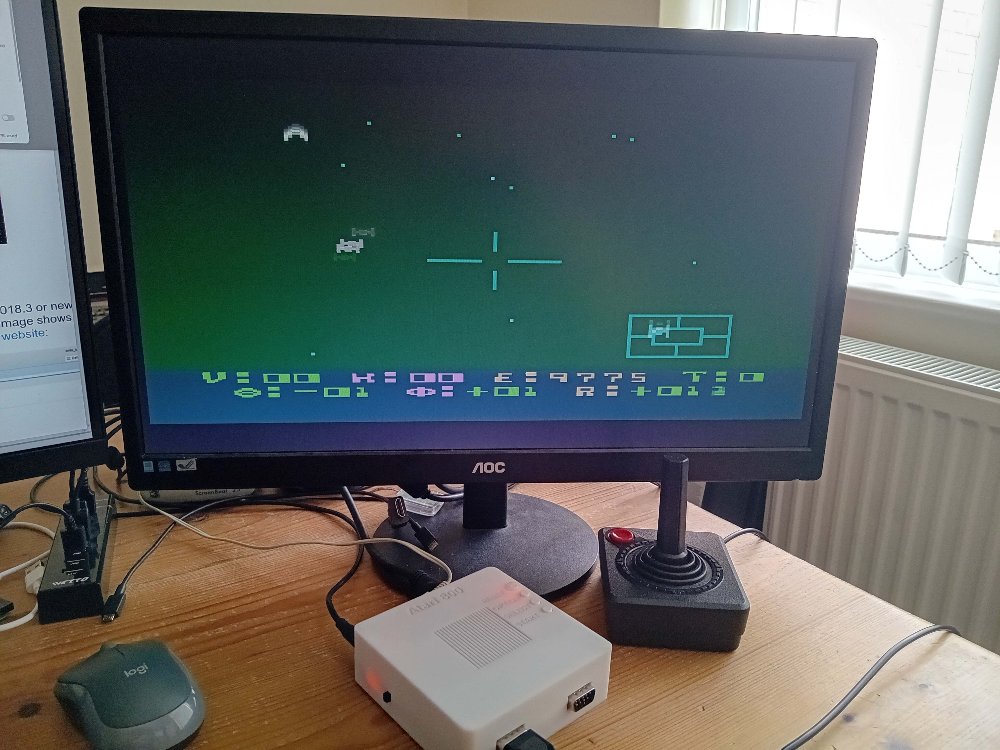
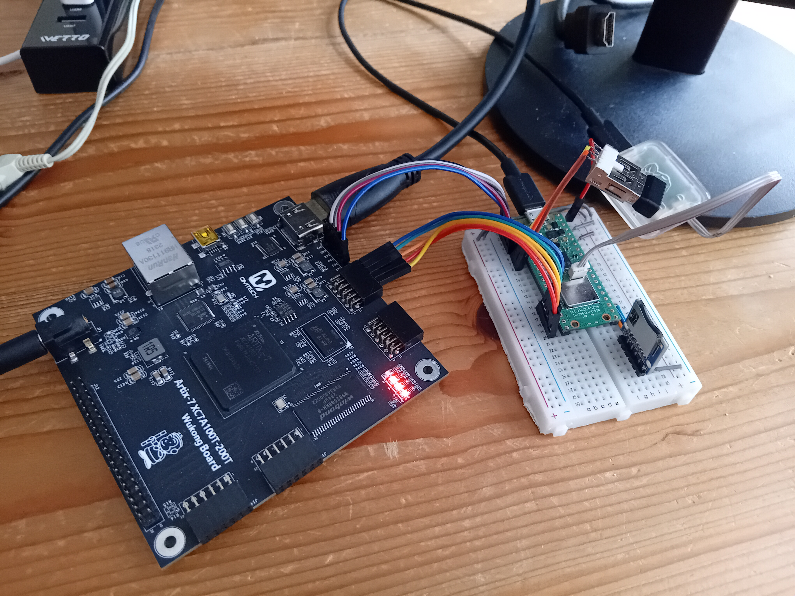

# atari800-spinalhdl

An **Atari 800 core written in SpinalHDL**, driven by an **RP2040 / Pico
supervisor** (C firmware) that configures the FPGA from an SD card at power-on,
hosts the USB keyboard, auto-boots from a JSON config, emulates SIO disk drives
(D1:–D4: from ATR images), and provides an on-screen (HDMI) Alt-F12 menu. The
6502 runs at real, **cycle-accurate 1.79 MHz** (with a runtime turbo toggle).

> **Active boards** — see **[STATUS.md](STATUS.md)** for the live snapshot:
> - **rp2040-qmtech-10cl025** — Cyclone 10 LP 10CL025 + RP2040-STAMP,
>   **720p** HDMI. The original.
> - **wukong-1080** — QMTech Wukong (Xilinx Artix-7 XC7A100T) + Pico 2 W,
>   **native 1080p60**, a fully self-contained SD appliance (FPGA bitstream + OS +
>   cart + disks all loaded from the card), with an optional **WiFi web UI** for
>   managing the SD over the network.
>
> Nothing proprietary lives in the FPGA image or firmware — the core `.rbf`/`.bit`,
> OS, cart, and disks all come from the SD card.

## Status

The Atari 800 core boots and runs correctly in simulation and on real hardware:

- **Memo pad** (no cartridge) — displays "ATARI COMPUTER - MEMO PAD"
- **Atari BASIC** (built-in 8K ROM) — boots to READY prompt
- **Star Raiders** (8K cartridge ROM) — boots to title screen

All ANTIC display modes, GTIA colour rendering (including highres mode 2),
DMA pipeline, NMI/IRQ handling, and the 6502 CPU are verified working.
Frame capture produces correct PAL-palette colour output.

**Hardware verified on the two active boards** (see **[STATUS.md](STATUS.md)**):
- **10CL025 + RP2040-STAMP** (720p): Star Raiders / Pole Position carts, DOS 2.5
  off an emulated SIO disk, the Alt-F12 on-screen menu, and SD-side FPGA boot.

- **Wukong (Artix-7) + Pico 2 W** (native 1080p60): a fully self-contained SD
  appliance — the Pico JTAG-configures the FPGA from the card, then loads OS +
  cart + disks from SD; plus an optional WiFi web UI for managing the card.



## Origins

This is a ground-up SpinalHDL rewrite of the **Atari 800 core from
[gyurco/Atari800XL](https://github.com/gyurco/Atari800XL)**, which targets
multiple FPGA boards with VHDL. The chip implementations (6502 CPU, ANTIC,
GTIA, POKEY, PIA) were rewritten in SpinalHDL based on the original VHDL
and Atari hardware documentation.

## Project Structure

```
build.sbt               Unified SBT build (Scala 2.13.18 / SpinalHDL 1.12.2)
atari/                   Atari 800 core
  src/main/scala/atari800/
    Atari800Core.scala        Top-level Atari 800 (CPU, ANTIC, GTIA, POKEY, PIA, MMU)
    Cpu65xx.scala             MOS 6502 CPU core
    Antic.scala               ANTIC (display list DMA, character/bitmap modes)
    Gtia.scala                GTIA (playfield/player-missile graphics, colours)
    Pokey.scala               POKEY (sound, keyboard, serial I/O, timers)
    Pia.scala                 PIA (parallel I/O, port B memory control)
    CartLogic.scala           Cartridge slot logic (8K/16K, RD4/RD5, OSS/XEGS variants)
    AddressDecoder.scala      Memory map, SDRAM/ROM/RAM routing
    InternalRomRam.scala      OS ROM + internal RAM (cart auto-replaces upper RAM)
    FileRom.scala             Generic ROM from binary .rom file (loaded at elaboration)
    Scandoubler.scala         15kHz→31kHz VGA scandoubler
    GtiaPalette.scala         Full PAL/NTSC colour palette (256 entries)
    Atari800CoreSim.scala     Simulation top-level wrapper
    Atari800CoreSimTb.scala   Simulation testbench with frame capture
    Atari800DiskSimTb.scala   SIO disk simulation with ATR image loader
    Atari800CoreSimTb.scala   (+ Atari800DiskSimTb) sim testbenches with frame capture
    Atari800CoreSimpleSdram.scala  Core + SDRAM-framebuffer video wrapper (active boards)
    Atari800Rp2040HdmiLgTop.scala  10CL025 + RP2040-STAMP top (720p HDMI)
    Atari800WukongTop.scala        Wukong (Artix-7 XC7A100T) top (native 1080p60)
    Atari800Wukong1080Top.scala    Wukong Phase-0 1080p colour-bar bring-up
    Atari800Ecp5Hdmi720Top.scala   Colorlight i5 (ECP5) top (720p)
    RpAtariKeyboard.scala     RP2040/Pico SPI link: keyboard, control, loader, SIO, text overlay
    SioBridge.scala           Hardware SIO UART bridge (disk emulation)
    HasBusIo.scala            Peripheral register-bus trait (mixed into SioBridge)
    VideoFbWrite / VideoFbRead2 / SdramArbiter3 / SdramStatemachine  SDRAM framebuffer + DDA scaler
    TextOverlay720.scala / TextOverlay1080.scala  FPGA-native on-screen menu text
    GtiaPalette.scala         Full PAL/NTSC colour palette; Debounce.scala; Font8x16.scala
firmware/supervisor/     RP2040/Pico supervisor C firmware (config-boot, USB kbd, SIO,
                         menu, SD-side FPGA config; Pico 2 W: WiFi + HTTP SD manager).
                         Build via CMake: -DBOARD=qmtech (STAMP) | wukong | colorlight
boards/
  rp2040-qmtech-10cl025/  ACTIVE: Cyclone 10 LP 10CL025 + RP2040-STAMP, 720p
    atari_starraiders/                Quartus project (make build → .sof → .rbf for SD)
  wukong-1080/            ACTIVE: QMTech Wukong (Artix-7) + Pico 2 W, 1080p60
    vivado/                           Vivado project (rgb2dvi HDMI, W9825 SDRAM); Makefile
    README.md                         board doc (architecture, wiring, make atari / push-core)
    HARDWARE.md / pin-mapping.md      board hardware ref (dual SDR+DDR3, pinouts, MiSTer bench)
  rp2040-colorlight/  Unified RP2040 + Colorlight i5/i9 (ECP5) / i9+ (Artix) SODIMM base board
  rp2040-qmtech-xc7a100t/  Custom Artix-7 baseboard (HDMI pin decision + docs)
  i5-7v0/                       Colorlight i5 (ECP5) 720p build scripts (oddrx2f_720/) + HDMI test
  i9plus-6v1/                   Colorlight i9+ v6.1 (XC7A50T, Vivado) + hdmi_test/
generated/               SpinalHDL output (.sv + .bin) — gitignored
tools/
  pico_kbd_test/         Pi Pico USB HID test fixture (TinyUSB-based)
```

## Building

### Prerequisites

- **JDK 11+** and **SBT 1.9+** — SpinalHDL (generates the SystemVerilog)
- **FPGA toolchain** for your board:
  - Intel Quartus Prime 25.1+ (Lite) — Cyclone 10 LP (10CL025)
  - Vivado 2025.2 — Artix-7 (Wukong, i9+)
  - yosys + nextpnr-ecp5 + ecppack — ECP5 (Colorlight i5/i9)
- **Supervisor firmware:** the Raspberry Pi **Pico SDK** + CMake (arm-none-eabi
  toolchain), and **`pyserial`** for the host deploy tool (`push_file.py`).
  `Pico-PIO-USB` is a submodule (USB-host keyboard). Build & flash instructions,
  including the board → `-DBOARD=` matrix, are in
  [`firmware/supervisor/README.md`](firmware/supervisor/README.md).

### Clone with submodule

```sh
git clone --recurse-submodules <url>
# or after clone:
git submodule update --init
```

### ROM files

Binary ROM files live in the `roms/` directory and are loaded at elaboration
time by `FileRom.scala`. They are **not** embedded in Scala source.

`roms/` is gitignored (along with `*.rom` and `*.atr` everywhere) — Atari
OS, BASIC, and game ROMs/disk images are copyrighted, you must supply
your own. Expected filenames (under `roms/`):

- `atariosb.rom`, `atarios2.rom` — 800 OS ROMs (D000-DFFF, E000-FFFF)
- `atarixl.rom` — XL OS (alternate)
- `ataribas.rom` — Atari BASIC
- `Star Raiders.rom`, `*.rom` — 8K/16K cartridge images
- `*.atr` — disk images for SIO disk emulation

### Run simulation

```sh
# Boot with Star Raiders cartridge (default configuration)
sbt "atari/runMain atari800.Atari800CoreSimTb"

# To change the cartridge, edit Atari800CoreSimTb.scala:
#   cartridge_rom = "roms/YourGame.rom"
# Place the .rom file in the roms/ directory
```

Frame captures are written as PPM files to `sim_workspace/Atari800_boot_test/`.
Convert to PNG with ImageMagick: `convert frame.ppm frame.png`

### Generate SystemVerilog

```sh
sbt "atari/runMain atari800.Atari800WukongSv"          # Wukong (Artix-7, 1080p)
sbt "atari/runMain atari800.Atari800Rp2040HdmiLgSv"    # 10CL025 + RP2040-STAMP (720p)
```

Output lands in `generated/` (gitignored). The active boards drive it through
their own build (`boards/wukong-1080/Makefile`,
`boards/rp2040-qmtech-10cl025/atari_starraiders/Makefile`).

### Board builds

Each active board builds from its own directory:

- **Wukong (Artix-7, native 1080p60)** — `boards/wukong-1080/`:
  `make atari` (build the `.bit` → push it to the SD → the supervisor configures
  the FPGA and boots the Atari, all over USB). See that board's `README.md`.
- **10CL025 + RP2040-STAMP (720p)** — `boards/rp2040-qmtech-10cl025/atari_starraiders/`:
  `make build` (Quartus) → `quartus_cpf -o bitstream_compression=off *.sof *.rbf`,
  then copy the `.rbf` to the SD as `/atari/800/core.rbf` (see `STATUS.md`).

OS, cartridge, and disk images come from the SD card (a JSON config), not baked
into the bitstream.

### Other board targets (Colorlight)

- **ECP5 720p (Colorlight i5, hardware-verified)** — `Atari800Ecp5Hdmi720Top`,
  built via `boards/i5-7v0/oddrx2f_720/build_atari720.sh` (yosys → nextpnr-ecp5 →
  ecppack). The i9 module (LFE5U-45F) shares the flow with more headroom.
- **Colorlight base board** (`boards/rp2040-colorlight/`) — one RP2040
  supervisor board taking either a Colorlight i5/i9 (ECP5) or i9+ (Artix XC7A50T)
  SODIMM module; FPGA pin constraints under `fpga/`.
- **Artix-7 i9+ 1080p HDMI timing probe** — `boards/i9plus-6v1/hdmi_test/`
  (`build_hdmi.tcl`), the OSERDES-on-real-pins check behind the i9+ 1080p analysis
  in that board's `README.md`.

*(The older top-level `i5-7v0/Makefile`, the whole `i9-7v2/` directory, and
`i9plus-6v1/synth_check.tcl` were fit-checks referencing tops that have since
been removed, so they were deleted too.)*

## Simulation

The testbench (`Atari800CoreSimTb`) provides:

- **Behavioral SDRAM model** — instant response, no controller needed
- **Raw Atari video frame capture** — samples VIDEO_B on colour clock,
  applies full 256-entry PAL palette, outputs PPM images
- **Diagnostic tracing** — DMA pipeline, ANTIC/GTIA register writes,
  NMI/IRQ events, CPU state snapshots, display shift register contents
- **Cartridge ROM loading** — any 8K `.rom` file loaded at elaboration time
  into the $A000-$BFFF cartridge slot

Configuration (`Atari800CoreSimTb` constructs `Atari800CoreSim`):
- `cycle_length = 32` — simulation speed (32 main clocks per colour clock)
- `internal_rom = 3` — Atari 800 OS (atariosb.rom + atarios2.rom)
- `internal_ram = 0` — all 48K RAM served by the behavioral SDRAM model (this is
  the core-in-isolation sim; the boards run RAM from BRAM instead)
- `cartridge_rom` — path to an 8K/16K ROM (default `roms/Star Raiders.rom`)

## Architecture

- **Atari 800 core**: 6502 CPU, ANTIC (DMA/display), GTIA (graphics/colour),
  POKEY (sound/keyboard/timers), PIA (I/O ports), MMU, cartridge logic — RAM + OS
  + cart all in **BRAM**, so ANTIC display DMA is never starved by contended SDRAM.
- **RP2040/Pico supervisor** (C firmware, `firmware/supervisor/`): SD-side FPGA
  config, USB-host keyboard, config-driven auto-boot, SIO disk emulation
  (`SioBridge`), an Alt-F12 on-screen menu, and (Pico 2 W) an optional WiFi web UI.
  Talks to the FPGA over a dedicated SPI link (`RpAtariKeyboard`).
- **Video**: the raw GTIA frame is captured to an **SDRAM framebuffer**, DDA-scaled
  to the output resolution (720p or 1080p) by `VideoFbRead2`, then `GtiaPalette` →
  HDMI (Digilent `rgb2dvi` on Artix; an ECP5/Cyclone TMDS serializer elsewhere).
- **Audio**: POKEY through a sigma-delta PWM DAC.

## Bugs Fixed

### GTIA highres colour (mode 2 text invisible)

The VHDL-to-SpinalHDL conversion had an off-by-one bit index in the highres
luminance replacement. VHDL declares colour registers as `std_logic_vector(7
downto 1)` (indices 1-7), while SpinalHDL uses 0-based indexing (0-6). The
VHDL index `(3 downto 1)` was copied directly instead of adjusting to
`(2 downto 0)`, causing the foreground colour to equal the background in
mode 2 (ANTIC's 40-column text mode). Fix: `Gtia.scala` lines 611-612.

## Resource Utilisation

The Atari (RAM + OS + cart) is entirely in BRAM; SDRAM carries only the video
framebuffer. OS/cart/disk load from SD at runtime. The Atari core itself is small
— the SDRAM framebuffer/scaler + on-screen overlay dominate the video path.

- **Cyclone 10 LP 10CL025** (720p, hardware-verified) — block RAM is the tight
  constraint: **66 / 66 M9K**; logic ~45%. See the M9K-budget notes in `STATUS.md`.
- **Artix-7 XC7A100T** (Wukong, 1080p, from the routed build) — **~4,192 LUT
  (6.6%), ~4,868 FF (3.8%), 22 BRAM36 (16%)**, 3 MMCM, 8 OSERDESE2, 0 DSP.
- **Artix-7 XC7A50T** (i9+) — the same core is die-independent in LUT/FF/BRAM, so
  it lands at **~13% LUT / ~29% BRAM** — comfortable. (The 1080p HDMI *timing*
  question for this part is analysed in `boards/i9plus-6v1/README.md`.)
- **ECP5** (Colorlight i5/i9, 720p) — fits with headroom; re-synthesise
  `Atari800Ecp5Hdmi720Top` for exact numbers.

## Acknowledgements

This project builds on a number of open-source works:

**FPGA / HDL**
- **[gyurco/Atari800XL](https://github.com/gyurco/Atari800XL)** (GPL-2.0) — the
  VHDL Atari 800 core this project is a ground-up SpinalHDL rewrite of.
- **[SpinalHDL](https://github.com/SpinalHDL/SpinalHDL)** — the hardware
  description language and toolchain the entire core is written in.
- **[Digilent rgb2dvi](https://github.com/Digilent/vivado-library)** — the
  TMDS / `OSERDESE2` encoder used for native 1080p60 HDMI on the Wukong (Artix-7)
  board (bundled under `boards/wukong-1080/vivado/src/rgb2dvi/`).

**Inspiration / references**
- **[MiST](https://github.com/mist-devel/mist-board)** and
  **[MiSTer](https://github.com/MiSTer-devel/Main_MiSTer)** — the FPGA
  retro-computing platforms whose core-design conventions informed this project.
  MiSTer's memory split in particular — low-latency SDR SDRAM for a core's main
  RAM, DDR for the framebuffer/scaler — is exactly the arrangement the Wukong
  board (W9825 SDR + MT41K DDR3) was chosen to provide, and the reference for
  eventually porting MiST/MiSTer cores to this Xilinx + Pico-supervisor world.
- **[wuxx/Colorlight-FPGA-Projects](https://github.com/wuxx/Colorlight-FPGA-Projects)**
  — the community reference for the Colorlight i5 / i9 (ECP5) and i9+ (Artix) SODIMM
  modules: pinouts, schematics, and the open-source (yosys/nextpnr) flow that the
  `i5-7v0/`, `i9plus-6v1/`, and `rp2040-colorlight/` boards build on.

**RP2040 / Pico supervisor firmware** (`firmware/supervisor/`)
- **[Raspberry Pi Pico SDK](https://github.com/raspberrypi/pico-sdk)**
  (BSD-3-Clause) — the RP2040 / RP2350 platform, build system, and drivers.
- **[TinyUSB](https://github.com/hathach/tinyusb)** (MIT, Ha Thach) — the USB
  device stack (CDC console, MSC drive, USB-Blaster vendor iface) and host stack.
- **[Pico-PIO-USB](https://github.com/sekigon-gonnoc/Pico-PIO-USB)** (MIT,
  sekigon-gonnoc) — bit-banged USB host over the RP2040/RP2350 PIO, for the USB
  keyboard.
- **[FatFs](http://elm-chan.org/fsw/ff/)** (1-clause BSD, ChaN) — FAT filesystem
  for reading OS/cart/disk images and JSON config from the SD card.
- **[lwIP](https://savannah.nongnu.org/projects/lwip/)** + the **CYW43 driver**
  (both via the Pico SDK) — TCP/IP and WiFi behind the Pico 2 W's on-network
  HTTP SD manager.

**FPGA programming**
- **[dirtyJTAG](https://github.com/jeanthom/DirtyJTAG)** (GPL-2.0, Jean THOMAS) —
  reference for the on-Pico JTAG loader (host **USB-Blaster emulation** so tools
  program directly, plus **SD-side FPGA config at power-on**).
- **[openFPGALoader](https://github.com/trabucayre/openFPGALoader)** — host-side
  FPGA programming (`dirtyJtag` / `usb-blaster` cables); its Xilinx `MEM_MODE`
  bit-ordering guided the Pico's stream-a-`.bit`-over-JTAG config on the Wukong.

**Development tools**
- **[gusmanb LogicAnalyzer](https://github.com/gusmanb/logicanalyzer)** — the
  RP2040 logic-analyzer firmware, run on a spare Pico as a bench instrument to
  capture the FPGA's debug taps (framebuffer/SPI-link bring-up). Used as a tool,
  not incorporated into this project's code.

## License

See individual source files. The Atari 800 core is derived from
[gyurco/Atari800XL](https://github.com/gyurco/Atari800XL) (GPL-2.0). Bundled
third-party firmware libraries retain their own licenses (see
`firmware/supervisor/lib/*/LICENSE` and the Acknowledgements above).
